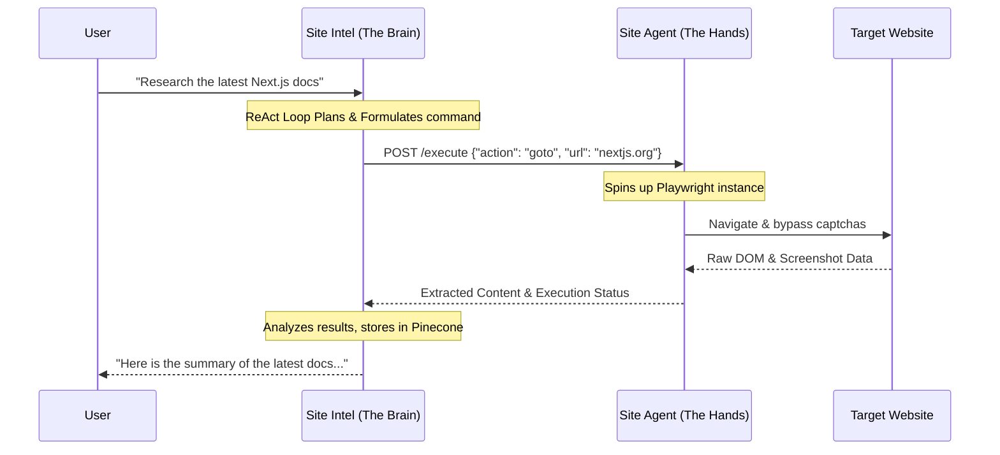

<div align="center">
  <h1>🕷️ Site Agent</h1>
  <p>
    <strong>The Autonomous, Unstoppable Browser Automation Engine</strong>
  </p>
  <p>
    <a href="https://playwright.dev/"></a>
    <a href="https://nodejs.org/"></a>
    <a href="https://typescriptlang.org/"></a>
    <a href="#"></a>
  </p>
</div>

<hr />

## 🚀 Overview

**Site Agent** is the operational extension—the **"Hands"**—to Site Intel's **"Brain."** 

While Site Intel is responsible for processing intelligence, maintaining long-term memory, and determining strategic execution via its LLM ReAct loops, **Site Agent** focuses purely on robust execution. It is a separate repository intentionally designed to handle heavy browser binaries, stealth navigation, complex DOM interactions, and background job orchestration without congesting the core intelligence API.

By keeping browser automation isolated in `site-agent`, we ensure that our primary reasoning server doesn't crash when a headless browser encounters an infinite redirect loop or immense memory pressure.

---

## 🔥 Key Capabilities

*   **🦾 Headless Chromium Automation**: Complete DOM manipulation and rendering engine powered by Playwright/Puppeteer.
*   **🕵️ Stealth & Anti-Bot Bypass**: Specialized launch arguments and fingerprint spoofing to slide past Cloudflare, DataDome, and advanced bot protections.
*   **🔄 Action Orchestration**: Takes JSON-structured commands from `site-intel` (the Brain) and translates them into physical clicks, scrolling, and typings.
*   **📸 Visual Validation**: Capable of taking full-page DOM snapshots, extracting HTML bounds, and saving screenshot traces for debugging and visual verification.
*   **💥 Fault Isolation**: Crash the parser, not the brain. By staying decoupled, memory leaks in browser tabs never impact our core API stability.

---

## 🏗️ Architecture Flow



---

## 🛠️ Quickstart

### 1. Installation
Clone this repository alongside `site-intel`.
```bash
git clone https://github.com/ayaan77/site-agent.git
cd site-agent
npm install
```

### 2. Install Browser Binaries
Automation tools require you to install the underlying browser executables:
```bash
npx playwright install chromium --with-deps
```

### 3. Environment Variables
Create a `.env` file in the root.
```env
PORT=4000
# Only allow connections from Site Intel
ALLOWED_ORIGIN=http://localhost:3000 
# Headless mode config
HEADLESS_MODE=true
```

### 4. Ignite the Agent
Boot up the execution engine:
```bash
npm run dev
```
The agent API will now be listening on `http://localhost:4000` waiting for instructions from `site-intel`.

---

## 🛡️ License

Built for autonomous dominance. Private software. All rights reserved.
